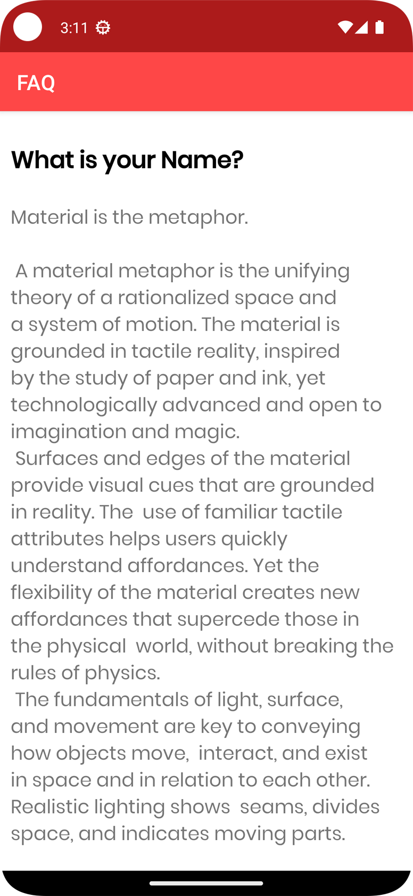

# Simple FAQ Android App

An Android app built in Java for displaying frequently asked questions. The app utilizes RecyclerView, a horizontal list layout, loaders, and supports multiple screens.

## Features

- RecyclerView for displaying FAQs
- Horizontal list layout for improved user experience
- Loaders for efficient data loading
- Multiscreen support for a responsive design
- Click on a list item to view detailed information about that item

## Prerequisites

- Android Studio
- Android SDK

## Getting Started

1. Clone the repository: `git clone <repository_url>`
2. Open the project in Android Studio.
3. Build and run the app on an Android emulator or physical device.

## Screenshots

  

    <strong>List of FAQs:</strong>
    The main screen displays a list of frequently asked questions (FAQs) for users to browse.
     
    
  

  

    <strong>FAQ Details:</strong>
    When a user clicks on a specific FAQ, the app navigates to a detailed view providing more information about the selected FAQ.
     
    
  

## Contributions

Contributions are welcome! Feel free to open issues or submit pull requests.

## License

This project is licensed under the MIT License - see the [LICENSE](LICENSE) file for details.
